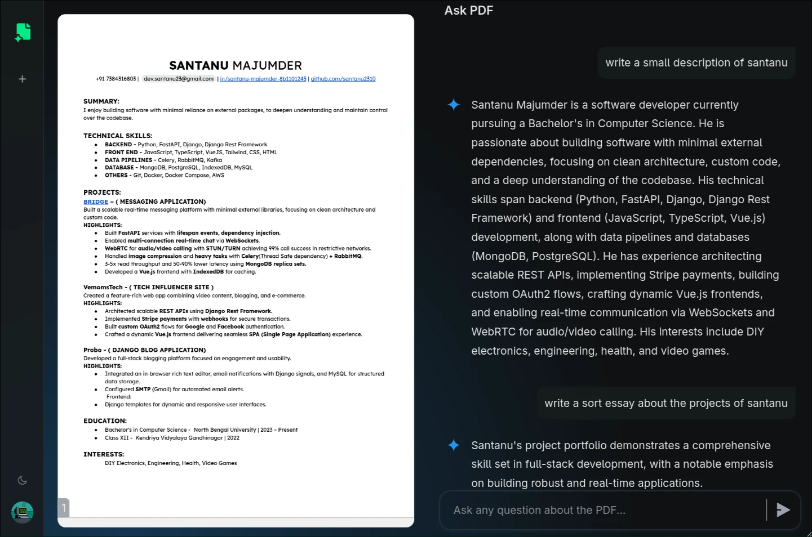
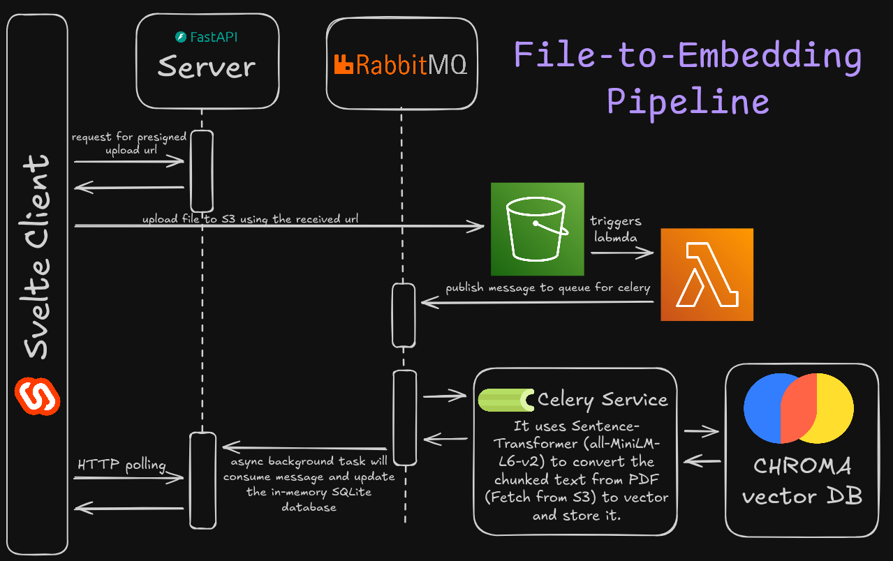
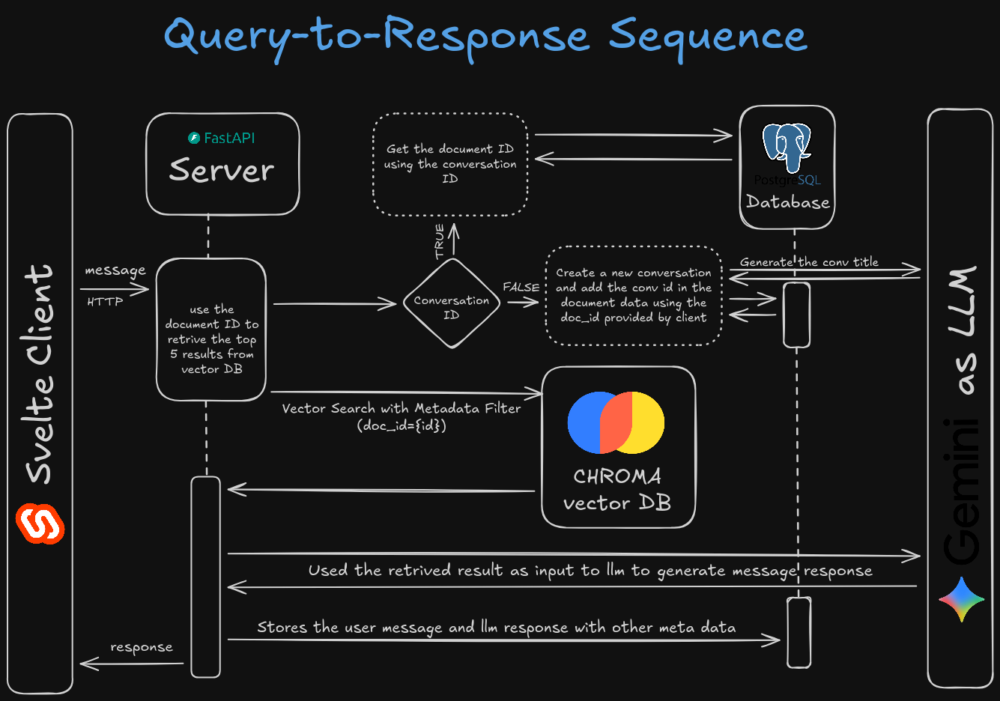

# AskPDF: RAG Application

AskPDF is a Retrieval-Augmented Generation (RAG) system designed to process large documents (PDFs) and provide accurate, context-aware answers to user queries. By leveraging vector embeddings and Large Language Models (LLMs), it allows users to interact with their document repository naturally.

## 🏗 System Architecture

The system is composed of three main microservices:

1. **Client (SvelteKit):** A responsive frontend for document management and chat interface.
2. **Server (FastAPI):** The core API handling user requests, database interactions, and LLM communication.
3. **PDF Processor (Python/Celery):** An asynchronous worker responsible for parsing PDFs, generating embeddings, and updating the vector store.

### File Ingestion Pipeline

When a user uploads a file, it goes through a secure signed URL process directly to S3, triggering an event-driven processing pipeline.

### Query & Response Flow

User queries are processed to retrieve relevant document contexts from ChromaDB, which are then fed into the Gemini LLM to generate precise answers with citations.

## 🚀 Features

- **Document Ingestion:** Secure upload and asynchronous processing of PDF documents.
- **Semantic Search:** Uses advanced embeddings (Sentence-Transformers) to find the most relevant document sections.
- **Contextual Answers:** Generates answers using Gemini LLM based _strictly_ on the provided context.
- **Citations:** Every answer includes citations pointing back to the specific source document and text.
- **Conversation History:** Maintains chat sessions for continuous context (partially implemented).

## 🛠 Tech Stack

- **Frontend:** SvelteKit, TypeScript, TailwindCSS
- **Backend:** FastAPI, Python, SQLAlchemy
- **AI/ML:** Sentence-Transformers, Gemini API, ChromaDB (Vector Store)
- **Database:** PostgreSQL, In-memory SQLite
- **Async Processing:** Celery, RabbitMQ/SQS
- **Infrastructure:** AWS Lambda, S3, Docker

